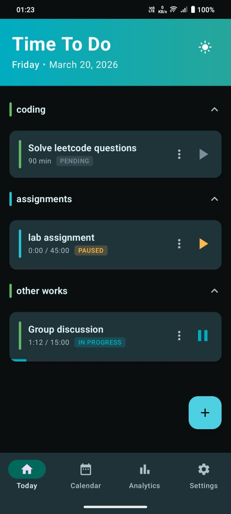
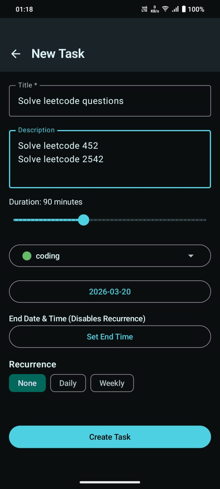
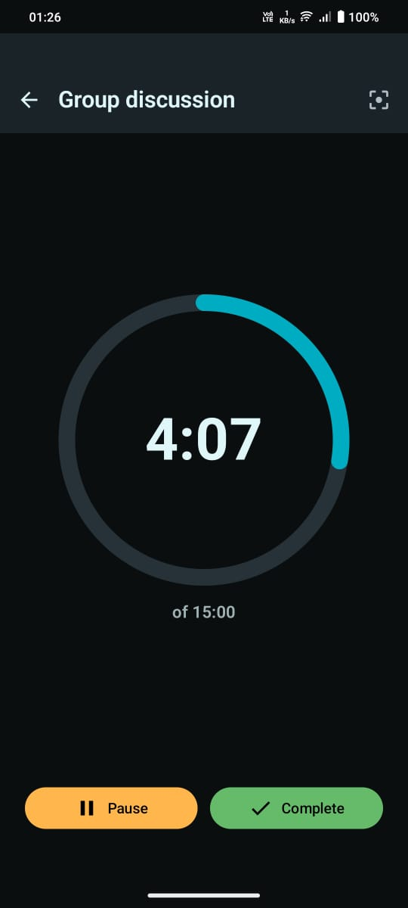
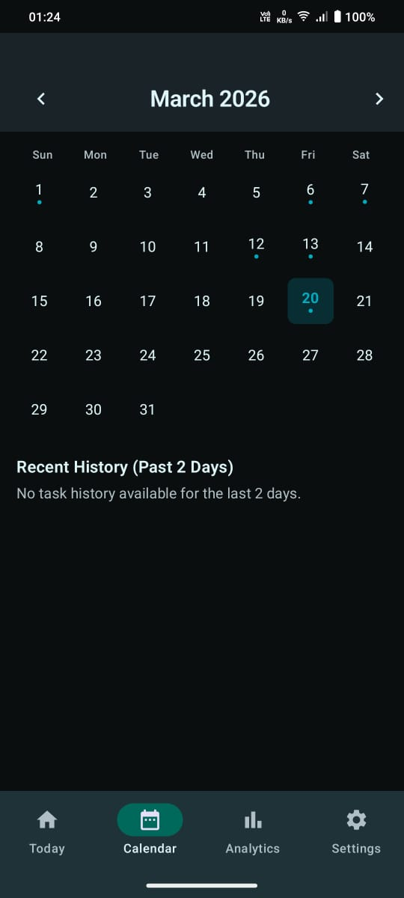
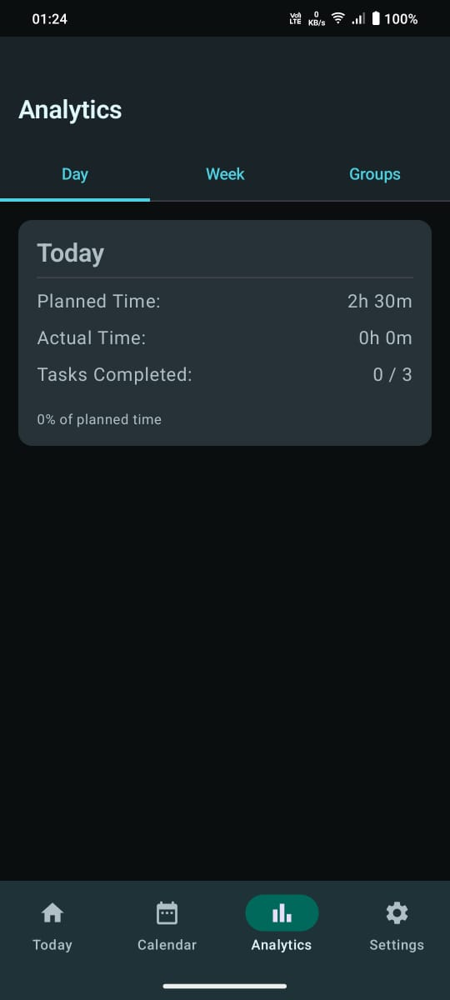

# TimeToDo - Turning Intentions into Actions

TimeToDo is a modern, offline-first Android application designed with a single goal: **to help you move from intention to execution instead of letting ideas sit idle.**

Unlike many complex task managers, TimeToDo doesn't want you to spend your day planning. It focuses on **time-boxed execution**—setting a constraint and sticking to it. If you have 45 minutes for a task, you focus on those 45 minutes and nothing else.

## ✨ Features

- **🎯 Constraint-Driven Focus**: Set a strict time limit for your tasks to stay within the flow.
- **⏱️ Real-Time Execution**: Track progress with a dedicated foreground service that keeps you accountable.
- **⏸️ Pause & Resume**: Handle unavoidable interruptions without losing track of your actual work time.
- **📱 Persistent Tracking**: A persistent notification ensures you are always aware of your current focus.
- **🗂️ Minimalist Management**: Organize tasks into simple categories (Coding, Assignments, etc.) without over-complicating.
- **🌙 Dark-Only Aesthetic**: A sleek, focused design that minimizes eye strain and distractions.
- **📡 100% Offline**: Your data stays on your device, private and always accessible.

## 🛠️ Built With

- **Kotlin**: Modern programming language for Android.
- **Jetpack Compose**: Declarative UI toolkit for building native interfaces.
- **Material 3**: The latest evolution of Material Design.
- **Room Database**: Robust local data persistence.
- **Coroutines & Flow**: For seamless asynchronous operations.
- **Foreground Services**: Ensuring accurate time tracking in the background.

## 🏗️ Architecture

TimeToDo is built with a decoupled, modern Android architecture to ensure reliability even when you're not looking at the app.

- **Presentation Layer**: Built 100% in **Jetpack Compose** using the **MVVM** pattern. It uses `StateFlow` to provide real-time updates from the background service to the UI.
- **Task Engine (`TimerService`)**: A robust **Foreground Service** handles the time-tracking logic. This ensures that your focus session isn't killed by the system and provides a persistent notification for quick actions.
- **Persistence Layer**: Powered by **Room Database**. Every second counts—literally. The app persists elapsed time frequently to ensure you never lose progress, even after a reboot.
- **State Management**: The `ActiveTaskStore` acts as a single source of truth for the currently running task, coordinating between the Database and the Service.

## 📖 How to Use

TimeToDo is designed to get you into "Action Mode" as fast as possible:

1. **Intention**: Tap the `+` button to create a new task. Give it a title and—most importantly—a **Duration Constraint**.
2. **Commitment**: Hit the **Start** icon on your task card. The app now shifts into execution mode.
3. **Execution**: A persistent notification will appear. You can now leave the app and focus on your work. The constraint is set.
4. **Completion**: Once finished, tap **Complete**. Your actual work time is recorded, helping you see the gap between intention and reality.

## 📸 Screenshots

| Home Screen | New Task | Timer |
|:---:|:---:|:---:|
|  |  |  |

| Calendar | Analytics |
|:---:|:---:|
|  |  |

## 🚀 Getting Started

To get a local copy up and running, follow these simple steps:

1. **Clone the repo**
   ```sh
   git clone https://github.com/YOUR_USERNAME/TimeToDo.git
   ```
2. **Open in Android Studio**
   Open the project folder in Android Studio (Ladybug or later recommended).
3. **Build & Run**
   Connect your Android device or start an emulator and click the "Run" button.

## 📄 License

This project is licensed under the MIT License - see the [LICENSE](LICENSE) file for details.
