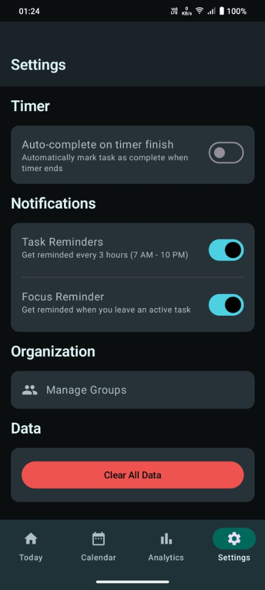
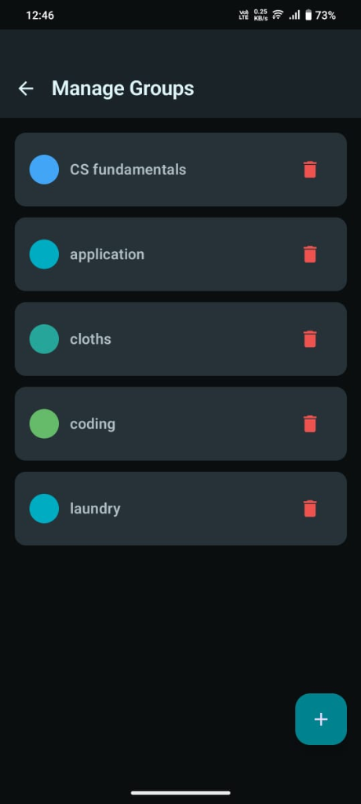
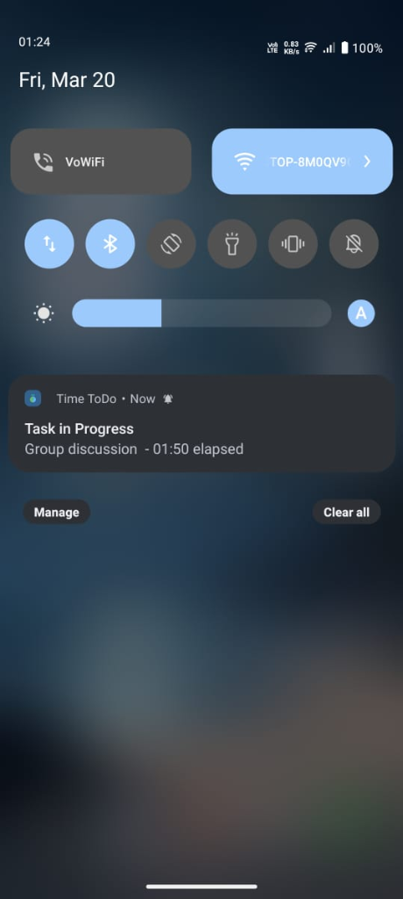

# TimeToDo - Turning Intentions into Actions

TimeToDo is a modern, offline-first Android application designed with a single goal: **to help you move from intention to execution instead of letting ideas sit idle.**

Unlike many complex task managers, TimeToDo doesn't want you to spend your day planning. It focuses on **time-boxed execution**—setting a constraint and sticking to it. If you have 45 minutes for a task, you focus on those 45 minutes and nothing else.

## ✨ Features

### 🗃️ Task Management (Full CRUD)
- **Create**: Add a task with a title, optional description, duration constraint (5–240 min), group, assigned date, recurrence, and end date/time.
- **Read**: View all tasks for today, browse by calendar date, or filter by day.
- **Update**: Edit any task field at any time via the Task Form (pre-fills all existing data).
- **Delete**: Remove tasks individually or wipe all data from Settings.
- **Status tracking**: Tasks move through `PENDING → IN_PROGRESS → COMPLETED` states.
- **Recurring tasks**: Set a task to repeat daily, weekly (pick specific days), or with a hard end date.

### ⏱️ Execution & Focus
- **Constraint-Driven Focus**: Set a strict time limit to stay in the flow.
- **Real-Time Timer**: Foreground service tracks time even when the app is backgrounded.
- **Pause & Resume**: Handle interruptions without losing actual work time.
- **Persistent Notification**: Always shows remaining time for the active task.
- **Auto-complete on timer finish**: Optional setting to auto-mark tasks complete when time runs out.

### 📅 Calendar & Scheduling
- **Monthly Calendar**: Tap any date to see its tasks.
- **Day View**: Full per-day task list with add/edit/execute actions.
- **Date assignment**: Assign tasks to specific dates for future planning.

### 📊 Analytics
- Productivity trends and completion rates.
- Time spent per task group.
- Focus session history.

### 🔔 Notifications & Settings
- **Task Reminders**: Get nudged every 3 hours (7 AM – 10 PM) — toggleable.
- **Focus Reminder**: Notified when you leave the app with an active task — toggleable.
- **Daily WorkManager reminder**: Scheduled at 9 AM every day.
- **Theme**: Choose Light / Dark / Follow System from Settings.
- **Manage Groups**: Create, rename, or delete task groups from Settings.
- **Clear All Data**: Wipe all tasks, groups, and history with a confirmation dialog.

### 🗂️ Organization
- Custom task groups (e.g. Coding, Assignments, Personal).
- Group-based filtering and analytics breakdown.

- **📡 100% Offline**: Your data stays on your device, private and always accessible.

## 🛠️ Built With

- **Kotlin**: Modern programming language for Android.
- **Jetpack Compose**: Declarative UI toolkit for building native interfaces.
- **Material 3**: The latest evolution of Material Design.
- **Room Database**: Robust local data persistence.
- **Coroutines & Flow**: For seamless asynchronous operations.
- **WorkManager**: Reliable background scheduling for reminders.
- **Foreground Services**: Ensuring accurate time tracking in the background.

## 🏗️ Architecture

TimeToDo is built with a decoupled, modern Android architecture (MVVM) to ensure reliability even when you're not looking at the app.

- **Presentation Layer**: Built 100% in **Jetpack Compose** using **MVVM**. `StateFlow` drives real-time UI updates.
- **Task Engine (`TimerService`)**: A **Foreground Service** handles time-tracking logic, immune to system kills.
- **Persistence Layer**: **Room Database** with DAOs for Tasks, Groups, and Execution sessions.
- **Analytics**: `AnalyticsEngine` aggregates execution history for productivity reporting.
- **Recurrence**: `RecurrenceCalculator` computes future occurrences for repeating tasks.
- **Notifications**: `ReminderScheduler` + `WorkManager` power daily nudges and focus reminders.

### 📁 Project Structure

```text
app/src/main/java/com/timetodo/
├── data/
│   ├── dao/                      # Room DAOs (TaskDao, GroupDao, TaskExecutionDao)
│   ├── entity/                   # Room entities (Task, Group, TaskExecution)
│   ├── AppDatabase.kt            # Room database configuration
│   ├── TaskRepository.kt         # Single data access point for all DAOs
│   ├── NotificationPreferences.kt # DataStore — task reminders & focus reminder toggles
│   └── ThemePreferences.kt       # DataStore — light/dark/system theme preference
├── domain/
│   ├── AnalyticsEngine.kt        # Productivity analytics: completion rates, trends
│   ├── RecurrenceCalculator.kt   # Computes next occurrences for recurring tasks
│   └── TimerManager.kt           # Central timer state manager (singleton)
├── navigation/
│   └── Navigation.kt             # Full nav graph with 8 routes
├── notification/
│   ├── FocusReminderHelper.kt    # Shows/cancels a reminder when user leaves an active task
│   ├── NotificationChannels.kt   # Creates system notification channels on app startup
│   ├── ReminderReceiver.kt       # BroadcastReceiver — handles alarm-triggered reminders + boot restore
│   └── ReminderScheduler.kt      # Schedules/cancels periodic task reminders via AlarmManager
├── service/
│   ├── AlarmReceiver.kt          # BroadcastReceiver for task alarm events
│   ├── TimerService.kt           # Foreground service — background time tracking + persistent notification
│   └── TimerWorker.kt            # WorkManager worker for timer-related background work
├── theme/                        # Material 3 color schemes and typography
├── ui/
│   ├── components/
│   │   ├── CalendarGrid.kt       # Monthly calendar grid component
│   │   ├── GroupSelector.kt      # Dropdown to pick a task group
│   │   ├── TaskCard.kt           # Task list item card with actions
│   │   └── TimerDisplay.kt       # Animated elapsed/remaining time display
│   ├── screens/
│   │   ├── TodayScreen.kt        # Home screen — today's tasks with start/complete actions
│   │   ├── CalendarScreen.kt     # Monthly calendar view — tap date to see tasks
│   │   ├── DayScreen.kt          # Per-day task list with add/edit/execute
│   │   ├── TaskFormScreen.kt     # Create or edit a task (full CRUD form)
│   │   ├── TaskExecutionScreen.kt# Active task timer screen with pause/resume/complete
│   │   ├── FocusModeScreen.kt    # Distraction-free fullscreen focus timer
│   │   ├── AnalyticsScreen.kt    # Productivity charts and session history
│   │   ├── SettingsScreen.kt     # Theme, notifications, groups, data management
│   │   ├── GroupManagementScreen.kt # Create, rename, delete task groups
│   │   └── BrandedHeader.kt      # App branding header component
│   └── viewmodels/
│       ├── TodayViewModel.kt     # State for today's task list
│       ├── CalendarViewModel.kt  # State for calendar and date selection
│       ├── DayViewModel.kt       # State for per-day task list
│       ├── TaskFormViewModel.kt  # State for task creation/editing form
│       ├── TaskExecutionViewModel.kt # State for active task timer
│       ├── GroupManagementViewModel.kt # State for group CRUD
│       └── AnalyticsViewModel.kt # State for analytics aggregation
├── util/
│   └── NotificationHelper.kt     # Utility to show/dismiss notifications
├── worker/
│   └── ReminderWorker.kt         # WorkManager — daily 9 AM task reminder
├── MainActivity.kt               # App entry point, permission handling, theme setup
└── TaskManagerApplication.kt     # Application class — creates notification channels
```

## 📖 How to Use

1. **Intention**: Tap `+` to create a task. Give it a title, group, and **Duration Constraint**.
2. **Commitment**: Hit **Start** on your task card — the app shifts into execution mode.
3. **Execution**: A persistent notification keeps you anchored. Leave the app and focus on your work.
4. **Completion**: Tap **Complete** when done. Your actual time is recorded for analytics.
5. **Review**: Head to **Analytics** to see your completion rates and focus patterns over time.

## 📸 Screenshots

| Home Screen | New Task | Timer |
|:---:|:---:|:---:|
|  |  |  |

| Calendar | Analytics |
|:---:|:---:|
|  |  |

| Settings | Manage Groups | Notification |
|:---:|:---:|:---:|
|  |  |  |

## 🚀 Getting Started

### Prerequisites

| Requirement | Minimum Version |
|---|---|
| Android Studio | Ladybug (2024.2.1) or later |
| Android SDK | API 26 (Android 8.0 Oreo) |
| Target SDK | API 34 (Android 14) |
| Kotlin | 1.9+ |
| JDK | 17 |

### Installation

1. **Clone the repo**
   ```sh
   git clone https://github.com/Saipramodh033/Time-ToDo.git
   ```
2. **Open in Android Studio** — File → Open → select the `TimeToDo` folder.
3. **Sync Gradle** — Android Studio will auto-sync dependencies.
4. **Build & Run** — connect your Android device (API 26+) or start an emulator and hit Run ▶.

> **Note**: No API keys or additional configuration needed. The app is fully self-contained and offline.

## ⚠️ Known Limitations

- **No cloud sync** — data is stored locally only; uninstalling the app clears all data.
- **Single user** — no multi-profile or multi-device support.
- **No widget** — home screen widget is not yet implemented.
- **Date picker** on TaskFormScreen uses a system dialog; full in-app date picker is planned.

## 🗺️ Roadmap

- [ ] Home screen widget for quick task start
- [ ] Export task history to CSV
- [ ] In-app date picker component
- [ ] Task priority levels
- [ ] Cloud backup (optional, opt-in)

## 🤝 Contributing

Contributions are welcome! Feel free to open issues or submit pull requests for bug fixes, improvements, or new features.

1. Fork the repo
2. Create your branch: `git checkout -b feat/your-feature`
3. Commit your changes: `git commit -m "feat: add your feature"`
4. Push: `git push origin feat/your-feature`
5. Open a Pull Request

